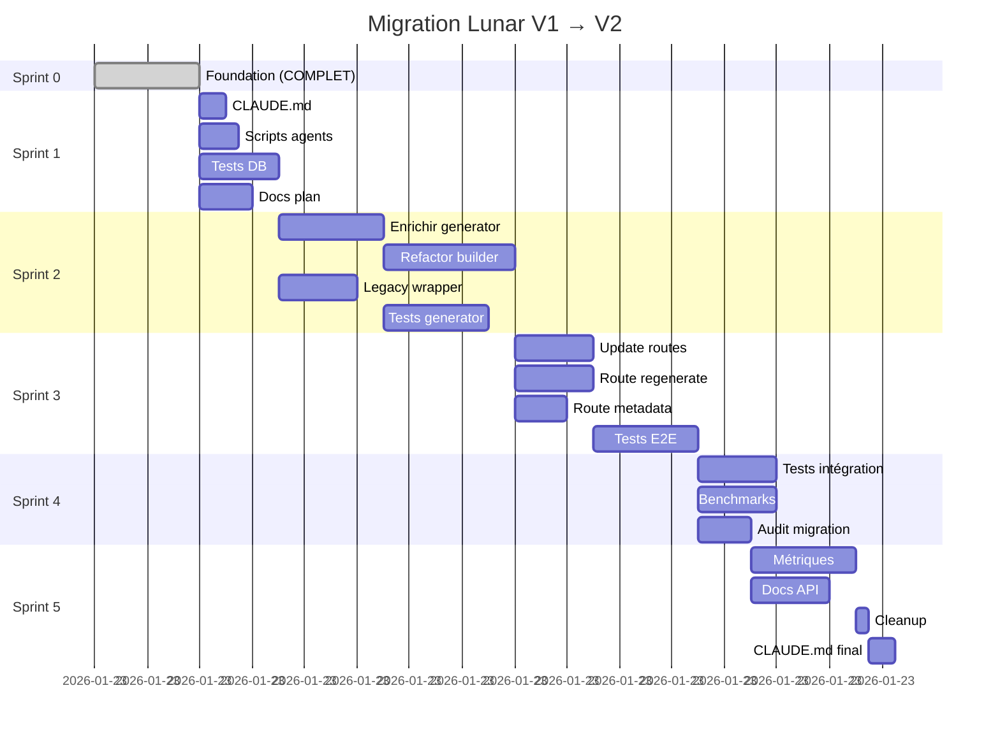

# Plan Migration Lunar V1 → V2

## 🎯 Objectif Global

Migrer l'architecture des révolutions lunaires de V1 (interprétations statiques pré-générées) vers V2 (interprétations temporelles générées à la volée avec fallback intelligents).

## 📊 État Initial (Sprint 0 - COMPLET ✅)

### Réalisations

- ✅ Modèles SQLAlchemy créés (`LunarInterpretation`, `LunarInterpretationTemplate`)
- ✅ Migrations Alembic créées et exécutées
- ✅ Tables DB créées (`lunar_interpretations`, `lunar_interpretation_templates`)
- ✅ Données migrées (1728 interprétations → templates)
- ✅ Service de base créé (`lunar_interpretation_generator.py`)
- ✅ Documentation architecture V2 (`LUNAR_ARCHITECTURE_V2.md`)

### Validation

```sql
-- Vérifier migration réussie
SELECT COUNT(*) FROM lunar_interpretation_templates;
-- Expected: 1728

SELECT COUNT(*) FROM lunar_interpretations;
-- Expected: 0 (vide, remplissage à la volée)

-- Backup accessible
SELECT COUNT(*) FROM pregenerated_lunar_interpretations_backup;
-- Expected: 1728
```

---

## 🚀 Sprint 1 : Infrastructure & Documentation (4h)

### Objectif
Préparer l'environnement pour travail multi-agents, documenter, tester modèles DB.

### Tâches Parallélisables

#### Task 1.1 : Mettre à jour CLAUDE.md ⭐ PRIORITÉ
**Durée** : 30min
**Agent** : Agent Main
**Parallélisable** : ❌ (document central)

**Actions** :
1. Ajouter section "Architecture Lunar V2" après Sprint 4
2. Documenter nouvelle hiérarchie de génération (4 niveaux)
3. Mettre à jour "Fichiers critiques" avec nouveaux services
4. Ajouter troubleshooting V2
5. Update "État du Sprint" → Sprint 5 planifié

**Critères succès** :
- CLAUDE.md à jour avec architecture V2
- Liens corrects vers nouveaux fichiers
- Exemples code V2 présents

---

#### Task 1.2 : Créer scripts utilitaires agents
**Durée** : 45min
**Agent** : Agent A
**Parallélisable** : ✅

**Fichiers à créer** :
```bash
scripts/agent_start.sh       # Enregistrer agent + créer lock
scripts/agent_complete.sh    # Marquer tâche complétée
scripts/agent_heartbeat.sh   # Update heartbeat (cron)
scripts/agent_status.sh      # Afficher dashboard
```

**Contenu `agent_start.sh`** :
```bash
#!/bin/bash
# Usage: ./scripts/agent_start.sh task_1_2 agent_A

TASK_ID=$1
AGENT_ID=$2

# Vérifier si tâche disponible
if [ -f ".tasks/locks/${TASK_ID}.lock" ]; then
  echo "❌ Tâche ${TASK_ID} déjà prise"
  exit 1
fi

# Créer lock
cat > ".tasks/locks/${TASK_ID}.lock" <<EOF
{
  "agent_id": "${AGENT_ID}",
  "task_id": "${TASK_ID}",
  "started_at": "$(date -u +%Y-%m-%dT%H:%M:%SZ)",
  "last_heartbeat": "$(date -u +%Y-%m-%dT%H:%M:%SZ)"
}
EOF

echo "✅ Tâche ${TASK_ID} assignée à ${AGENT_ID}"
```

**Critères succès** :
- 4 scripts exécutables créés
- Tests manuels passent
- Documentation usage dans README.md

---

#### Task 1.3 : Créer tests modèles DB ⭐ PRIORITÉ
**Durée** : 1h30
**Agent** : Agent B
**Parallélisable** : ✅

**Fichiers à créer** :
```
tests/test_lunar_interpretation_model.py
tests/test_lunar_interpretation_template_model.py
```

**Tests LunarInterpretation** :
```python
async def test_create_lunar_interpretation():
    """Test création basique"""

async def test_unique_constraint():
    """Test UNIQUE(lunar_return_id, subject, lang, version)"""

async def test_fk_cascade_delete():
    """Test ON DELETE CASCADE (user + lunar_return)"""

async def test_input_json_stored():
    """Test stockage contexte complet"""

async def test_multiple_subjects():
    """Test même lunar_return_id, subjects différents"""
```

**Tests LunarInterpretationTemplate** :
```python
async def test_create_template():
    """Test création template"""

async def test_unique_constraint_full():
    """Test UNIQUE template_type=full"""

async def test_nullable_fields():
    """Test moon_sign=NULL si template_type='focus'"""

async def test_query_performance():
    """Test index lookup rapide"""
```

**Critères succès** :
- Au moins 10 tests par modèle
- Coverage > 80%
- Tous tests passent (`pytest tests/test_lunar_interpretation*.py -v`)

---

#### Task 1.4 : Documenter plan sprints détaillé
**Durée** : 1h
**Agent** : Agent C
**Parallélisable** : ✅

**Fichier** : `docs/MIGRATION_PLAN.md` (ce fichier, à compléter)

**Sections à ajouter** :
1. Timeline détaillée (Gantt)
2. Décisions architecturales (ADR format)
3. Risks & Mitigations
4. Rollback plan
5. Go-live checklist

**Critères succès** :
- Plan complet et clair
- Gantt chart inclus (Mermaid)
- Validé par équipe

---

### Résumé Sprint 1

| Task | Agent | Durée | Parallèle | Priorité |
|------|-------|-------|-----------|----------|
| 1.1 CLAUDE.md | Main | 30min | ❌ | ⭐⭐⭐ |
| 1.2 Scripts | A | 45min | ✅ | ⭐⭐ |
| 1.3 Tests DB | B | 1h30 | ✅ | ⭐⭐⭐ |
| 1.4 Docs | C | 1h | ✅ | ⭐⭐ |

**Total** : 3h45 (séquentiel) ou 1h30 (parallèle avec 3 agents)

---

## 🔧 Sprint 2 : Service Layer Refactoring (6h)

### Objectif
Enrichir service de génération, refactorer lunar_report_builder, créer tests complets.

### Tâches

#### Task 2.1 : Enrichir lunar_interpretation_generator.py ⭐ PRIORITÉ
**Durée** : 2h
**Agent** : Agent A
**Parallélisable** : ✅

**Améliorations à ajouter** :

1. **Métriques Prometheus** :
```python
from prometheus_client import Counter, Histogram, Gauge

lunar_interpretation_generated = Counter(
    'lunar_interpretation_generated_total',
    'Total interprétations générées',
    ['source', 'model', 'subject']
)

lunar_interpretation_duration = Histogram(
    'lunar_interpretation_generation_duration_seconds',
    'Durée génération interprétation',
    ['source', 'subject']
)

active_generations = Gauge(
    'lunar_interpretation_active_generations',
    'Générations en cours'
)
```

2. **Logs structurés** :
```python
import structlog

logger = structlog.get_logger(__name__)

logger.info(
    "lunar_interpretation_generated",
    lunar_return_id=lunar_return_id,
    user_id=user_id,
    subject=subject,
    source=source,
    model_used=model_used,
    duration_ms=duration
)
```

3. **Retry logic Claude** :
```python
from tenacity import retry, stop_after_attempt, wait_exponential

@retry(
    stop=stop_after_attempt(3),
    wait=wait_exponential(multiplier=1, min=2, max=10),
    reraise=True
)
async def _call_claude_with_retry(...):
    ...
```

4. **Timeouts** :
```python
import asyncio

try:
    output = await asyncio.wait_for(
        _generate_via_claude(...),
        timeout=30.0  # 30s max
    )
except asyncio.TimeoutError:
    logger.error("Claude timeout, falling back to template")
    # Fallback...
```

5. **Error categorization** :
```python
class LunarInterpretationError(Exception):
    pass

class ClaudeAPIError(LunarInterpretationError):
    pass

class TemplateNotFoundError(LunarInterpretationError):
    pass
```

**Critères succès** :
- Métriques implémentées et testées
- Logs structurés (JSON output)
- Retry logic fonctionne (test mock)
- Timeout respecté (<30s)
- Coverage > 85%

---

#### Task 2.2 : Refactorer lunar_report_builder.py
**Durée** : 2h30
**Agent** : Agent B
**Parallélisable** : ✅ (dépend de 2.1 terminé)

**Changements à faire** :

1. **Remplacer imports** :
```python
# Ancien
from services.lunar_interpretation_service import (
    load_lunar_interpretation_with_fallback,
    format_weekly_advice_v2
)

# Nouveau
from services.lunar_interpretation_generator import (
    generate_or_get_interpretation
)
```

2. **Refactor `build_lunar_report_v4_async()`** :
```python
# AVANT (lignes 811-889)
lunar_interpretation = {...}
interpretation_source = 'fallback'
weekly_advice_db = None

if db is not None:
    interpretation_full, weekly_advice_db, interpretation_source = \
        await load_lunar_interpretation_with_fallback(...)

# APRÈS
from services.lunar_interpretation_generator import generate_or_get_interpretation

output_text, weekly_advice, source, model_used = await generate_or_get_interpretation(
    db=db,
    lunar_return_id=lunar_return.id,
    user_id=lunar_return.user_id,
    subject='full',
    version=settings.LUNAR_INTERPRETATION_VERSION,
    lang='fr'
)

lunar_interpretation['full'] = output_text
interpretation_source = source
```

3. **Ajouter metadata dans réponse** :
```python
return {
    'header': {...},
    'general_climate': ...,
    'dominant_axes': ...,
    'major_aspects': ...,
    'lunar_interpretation': {...},
    'weekly_advice': weekly_advice or {},
    'metadata': {  # NOUVEAU
        'source': source,
        'model_used': model_used,
        'version': settings.LUNAR_INTERPRETATION_VERSION,
        'generated_at': datetime.utcnow().isoformat()
    }
}
```

**Critères succès** :
- Ancien code supprimé (load_lunar_interpretation_with_fallback)
- Nouveau service intégré
- Tests existants passent
- Metadata présente dans réponses

---

#### Task 2.3 : Créer facade rétrocompatibilité
**Durée** : 1h30
**Agent** : Agent C
**Parallélisable** : ✅

**Fichier** : `services/lunar_interpretation_legacy_wrapper.py`

**Objectif** : Wrapper pour code existant qui appelle ancien service

```python
"""
Wrapper rétrocompatibilité V1 → V2
Permet transition progressive sans casser code existant
"""

async def load_lunar_interpretation_with_fallback(
    db: AsyncSession,
    moon_sign: str,
    moon_house: int,
    lunar_ascendant: str,
    preferred_version: int = 2,
    lang: str = 'fr'
) -> Tuple[str, Optional[Dict], str]:
    """
    DEPRECATED: Utiliser generate_or_get_interpretation() directement

    Wrapper rétrocompatibilité V1 → V2
    """
    import warnings
    warnings.warn(
        "load_lunar_interpretation_with_fallback() is deprecated, "
        "use generate_or_get_interpretation() instead",
        DeprecationWarning,
        stacklevel=2
    )

    # Trouver lunar_return_id depuis moon_sign/house/asc
    # (logique à implémenter)
    ...

    # Appeler nouveau service
    from services.lunar_interpretation_generator import generate_or_get_interpretation

    output, weekly, source, model = await generate_or_get_interpretation(
        db=db,
        lunar_return_id=lunar_return_id,
        user_id=user_id,
        subject='full',
        version=preferred_version,
        lang=lang
    )

    return output, weekly, source
```

**Critères succès** :
- Wrapper fonctionne avec ancien code
- Warning émis lors de l'appel
- Tests rétrocompatibilité passent

---

#### Task 2.4 : Tests unitaires lunar_interpretation_generator.py ⭐ PRIORITÉ
**Durée** : 2h
**Agent** : Agent A (après 2.1)
**Parallélisable** : ✅ (dépend de 2.1)

**Fichier** : `tests/test_lunar_interpretation_generator.py`

**Tests à implémenter** :

```python
async def test_generate_idempotent():
    """2 appels successifs → même résultat (cache)"""

async def test_fallback_hierarchy():
    """DB temporelle → Claude → DB template → hardcoded"""

async def test_versionning():
    """Générer v2 puis v3 → 2 entries distinctes"""

async def test_force_regenerate():
    """force_regenerate=True → ignore cache"""

async def test_claude_timeout():
    """Si Claude >30s → fallback template"""

async def test_claude_error_fallback():
    """APIError → fallback template"""

async def test_metrics_recorded():
    """Métriques Prometheus enregistrées"""

async def test_logs_structured():
    """Logs JSON structurés"""

async def test_input_context_stored():
    """input_json contient contexte complet"""

async def test_weekly_advice_parsing():
    """weekly_advice correctement parsé"""
```

**Critères succès** :
- Au moins 15 tests
- Coverage > 90%
- Tous tests passent
- Mocks Claude API

---

### Résumé Sprint 2

| Task | Agent | Durée | Dépendances | Priorité |
|------|-------|-------|-------------|----------|
| 2.1 Enrichir generator | A | 2h | - | ⭐⭐⭐ |
| 2.2 Refactor builder | B | 2h30 | 2.1 | ⭐⭐⭐ |
| 2.3 Legacy wrapper | C | 1h30 | - | ⭐⭐ |
| 2.4 Tests generator | A | 2h | 2.1 | ⭐⭐⭐ |

**Total** : 8h (séquentiel) ou 4h30 (parallèle avec 3 agents)

---

## 🌐 Sprint 3 : API Layer & Routes (5h)

### Objectif
Mettre à jour routes API, créer nouveaux endpoints, tester E2E.

### Tâches

#### Task 3.1 : Mettre à jour routes/lunar.py ⭐ PRIORITÉ
**Durée** : 1h30
**Agent** : Agent A
**Parallélisable** : ✅

**Endpoints à modifier** :

**`POST /api/lunar-returns/current/report`** (existant) :
```python
# AVANT
report = await build_lunar_report_v4_async(lunar_return, db)

# APRÈS
report = await build_lunar_report_v4_async(lunar_return, db)
# (lunar_report_builder déjà refactoré en 2.2)

# Ajouter metadata dans response
return JSONResponse({
    'report': report,
    'metadata': report.get('metadata', {})  # Source, model_used, etc.
})
```

**Critères succès** :
- Endpoint existant fonctionne
- Metadata présente dans réponse
- Tests E2E passent

---

#### Task 3.2 : Créer route POST /api/lunar/interpretation/regenerate
**Durée** : 1h30
**Agent** : Agent B
**Parallélisable** : ✅

**Nouveau endpoint** :

```python
@router.post("/interpretation/regenerate")
async def regenerate_lunar_interpretation(
    lunar_return_id: int,
    subject: str = 'full',
    db: AsyncSession = Depends(get_db),
    current_user: User = Depends(get_current_user)
):
    """
    Force régénération d'une interprétation lunaire

    Cas d'usage:
    - Amélioration du prompt (nouvelle version)
    - Utilisateur insatisfait de la qualité
    - Debug/test
    """
    from services.lunar_interpretation_generator import generate_or_get_interpretation

    # Vérifier ownership
    lunar_return = await db.get(LunarReturn, lunar_return_id)
    if not lunar_return or lunar_return.user_id != current_user.id:
        raise HTTPException(status_code=404, detail="LunarReturn not found")

    # Forcer régénération
    output, weekly, source, model = await generate_or_get_interpretation(
        db=db,
        lunar_return_id=lunar_return_id,
        user_id=current_user.id,
        subject=subject,
        force_regenerate=True  # KEY
    )

    return {
        'interpretation': output,
        'weekly_advice': weekly,
        'metadata': {
            'source': source,
            'model_used': model,
            'regenerated_at': datetime.utcnow().isoformat()
        }
    }
```

**Critères succès** :
- Endpoint fonctionne (201 Created)
- Force regenerate vérifié
- Ownership check OK
- Tests E2E passent

---

#### Task 3.3 : Créer route GET /api/lunar/interpretation/metadata
**Durée** : 1h
**Agent** : Agent C
**Parallélisable** : ✅

**Nouveau endpoint** (stats) :

```python
@router.get("/interpretation/metadata")
async def get_lunar_interpretation_metadata(
    db: AsyncSession = Depends(get_db),
    current_user: User = Depends(get_current_user)
):
    """
    Statistiques interprétations lunaires

    Returns:
        - Nb total interprétations user
        - Répartition sources (db_temporal, claude, template)
        - Models utilisés
        - Moyenne durée génération
    """
    from sqlalchemy import func, select
    from models import LunarInterpretation

    # Query stats
    total_query = select(func.count()).select_from(LunarInterpretation).where(
        LunarInterpretation.user_id == current_user.id
    )
    total = await db.scalar(total_query)

    # Répartition par model
    models_query = select(
        LunarInterpretation.model_used,
        func.count()
    ).where(
        LunarInterpretation.user_id == current_user.id
    ).group_by(LunarInterpretation.model_used)

    models_result = await db.execute(models_query)
    models_stats = dict(models_result.all())

    return {
        'user_id': current_user.id,
        'total_interpretations': total,
        'models_used': models_stats,
        'cached_rate': models_stats.get('template', 0) / total if total > 0 else 0
    }
```

**Critères succès** :
- Stats correctes
- Performance OK (<100ms)
- Tests passent

---

#### Task 3.4 : Tests E2E routes API ⭐ PRIORITÉ
**Durée** : 2h
**Agent** : Agent A (après 3.1, 3.2)
**Parallélisable** : ✅ (dépend de 3.1, 3.2)

**Fichier** : `tests/test_lunar_routes_v2.py`

**Tests HTTP complets** :

```python
async def test_get_lunar_report_with_metadata():
    """POST /api/lunar-returns/current/report → metadata présente"""

async def test_regenerate_interpretation():
    """POST /api/lunar/interpretation/regenerate → force refresh"""

async def test_regenerate_unauthorized():
    """POST regenerate autre user → 404"""

async def test_metadata_endpoint():
    """GET /api/lunar/interpretation/metadata → stats correctes"""

async def test_concurrent_requests():
    """10 requests parallèles → idempotence garantie"""

async def test_response_format():
    """Validation schéma réponse (Pydantic)"""
```

**Critères succès** :
- Au moins 10 tests E2E
- Coverage routes > 80%
- Tous tests passent

---

### Résumé Sprint 3

| Task | Agent | Durée | Dépendances | Priorité |
|------|-------|-------|-------------|----------|
| 3.1 Update routes | A | 1h30 | Sprint 2 | ⭐⭐⭐ |
| 3.2 Route regenerate | B | 1h30 | - | ⭐⭐ |
| 3.3 Route metadata | C | 1h | - | ⭐ |
| 3.4 Tests E2E | A | 2h | 3.1, 3.2 | ⭐⭐⭐ |

**Total** : 6h (séquentiel) ou 3h30 (parallèle avec 3 agents)

---

## 🧪 Sprint 4 : Testing & Quality Assurance (4h)

### Objectif
Tests intégration complets, benchmarks performance, validation migration.

### Tâches

#### Task 4.1 : Tests intégration service → DB ⭐ PRIORITÉ
**Durée** : 1h30
**Agent** : Agent A
**Parallélisable** : ✅

**Fichier** : `tests/test_lunar_integration.py`

**Tests complexes** :

```python
async def test_full_flow_generate_save_retrieve():
    """Workflow complet: generate → save DB → retrieve cache"""

async def test_race_condition():
    """2 requests simultanées même lunar_return_id → 1 seule génération"""

async def test_concurrent_different_subjects():
    """Concurrent: full + climate + focus → 3 entries distinctes"""

async def test_version_upgrade():
    """Générer v2, upgrade v3, v2 toujours accessible"""

async def test_fallback_cascade():
    """Cascade complète: DB temp fail → Claude fail → template OK"""
```

**Critères succès** :
- Tests race conditions passent
- Concurrency gérée correctement
- Coverage > 85%

---

#### Task 4.2 : Tests performance (benchmarks)
**Durée** : 1h30
**Agent** : Agent B
**Parallélisable** : ✅

**Fichier** : `tests/test_lunar_performance.py`

**Benchmarks** :

```python
def test_cache_hit_performance():
    """Cache DB: <50ms"""

def test_generation_claude_performance():
    """Génération Claude: <5s (median), <10s (p95)"""

def test_template_fallback_performance():
    """Fallback template: <100ms"""

def test_db_query_count():
    """1 request → max 3 queries DB (lunar_return + interp + user)"""

def test_concurrent_throughput():
    """100 requests/s sans dégradation"""
```

**Outils** :
- `pytest-benchmark`
- `locust` (load testing)

**Critères succès** :
- Cache hit <50ms
- Claude <10s p95
- Query count ≤3

---

#### Task 4.3 : Validation données migrées ⭐ PRIORITÉ
**Durée** : 1h
**Agent** : Agent C
**Parallélisable** : ❌ (accès DB prod)

**Fichier** : `scripts/audit_lunar_migration.py`

**Validations** :

```python
async def audit_migration():
    # 1. Vérifier count
    count_templates = await db.scalar(
        select(func.count()).select_from(LunarInterpretationTemplate)
    )
    assert count_templates == 1728, f"Expected 1728, got {count_templates}"

    # 2. Comparer échantillon V1 vs V2
    sample_v1 = await db.execute(
        select(PregeneratedLunarInterpretationBackup).limit(100)
    )
    for row_v1 in sample_v1:
        # Trouver équivalent V2
        row_v2 = await db.execute(
            select(LunarInterpretationTemplate).filter_by(
                moon_sign=row_v1.moon_sign,
                moon_house=row_v1.moon_house,
                lunar_ascendant=row_v1.lunar_ascendant,
                version=row_v1.version,
                lang=row_v1.lang
            )
        )
        assert row_v2 is not None, f"Missing V2 for {row_v1}"
        assert row_v2.template_text == row_v1.interpretation_full

    # 3. Vérifier aucune perte données
    assert no_data_loss()

    print("✅ Migration validée, aucune perte de données")
```

**Critères succès** :
- 1728 templates présents
- Échantillon 100 lignes identiques V1 vs V2
- Aucune perte données

---

### Résumé Sprint 4

| Task | Agent | Durée | Parallèle | Priorité |
|------|-------|-------|-----------|----------|
| 4.1 Tests intégration | A | 1h30 | ✅ | ⭐⭐⭐ |
| 4.2 Benchmarks perf | B | 1h30 | ✅ | ⭐⭐ |
| 4.3 Audit migration | C | 1h | ❌ | ⭐⭐⭐ |

**Total** : 4h (séquentiel) ou 1h30 (parallèle avec 3 agents)

---

## 📊 Sprint 5 : Monitoring, Docs & Cleanup (4h)

### Objectif
Monitoring production, documentation finale, nettoyage backup.

### Tâches

#### Task 5.1 : Implémenter métriques Prometheus
**Durée** : 2h
**Agent** : Agent A
**Parallélisable** : ✅

**Fichiers** :
- `services/lunar_metrics.py`
- `main.py` (intégration)

**Métriques à exposer** :

```python
from prometheus_client import Counter, Histogram, Gauge, Info

# Counters
lunar_interpretation_generated_total = Counter(
    'lunar_interpretation_generated_total',
    'Total interprétations générées',
    ['source', 'model', 'subject', 'version']
)

lunar_interpretation_cache_hit_total = Counter(
    'lunar_interpretation_cache_hit_total',
    'Total cache hits',
    ['subject', 'version']
)

lunar_interpretation_fallback_total = Counter(
    'lunar_interpretation_fallback_total',
    'Total fallbacks',
    ['fallback_level']  # template, hardcoded
)

# Histograms
lunar_interpretation_duration_seconds = Histogram(
    'lunar_interpretation_duration_seconds',
    'Durée génération interprétation',
    ['source', 'subject'],
    buckets=(0.05, 0.1, 0.5, 1, 2, 5, 10, 30)
)

# Gauges
lunar_active_generations = Gauge(
    'lunar_active_generations',
    'Générations en cours'
)

# Info
lunar_migration_info = Info(
    'lunar_migration',
    'État migration V1 → V2'
)
lunar_migration_info.info({
    'version': '2.0',
    'templates_count': '1728',
    'migration_date': '2026-01-23'
})
```

**Endpoint Prometheus** :
```python
# main.py
from prometheus_client import make_asgi_app

metrics_app = make_asgi_app()
app.mount("/metrics", metrics_app)
```

**Critères succès** :
- Endpoint `/metrics` accessible
- Métriques exportées format Prometheus
- Grafana dashboard créé (optionnel)

---

#### Task 5.2 : Documentation finale utilisateur
**Durée** : 1h30
**Agent** : Agent B
**Parallélisable** : ✅

**Fichier** : `docs/API_LUNAR_V2.md`

**Sections** :

1. **Quick Start**
```bash
# Obtenir rapport lunaire
curl -X POST https://api.astroia.com/api/lunar-returns/current/report \
  -H "Authorization: Bearer $TOKEN" \
  -H "Content-Type: application/json" \
  -d '{"month": "2026-02"}'
```

2. **Endpoints V2**
- `POST /api/lunar-returns/current/report`
- `POST /api/lunar/interpretation/regenerate`
- `GET /api/lunar/interpretation/metadata`

3. **Schémas réponse**
```json
{
  "report": {...},
  "metadata": {
    "source": "claude",
    "model_used": "claude-opus-4-5-20251101",
    "version": 2,
    "generated_at": "2026-01-23T15:00:00Z"
  }
}
```

4. **Migration V1 → V2**
- Breaking changes (si applicable)
- Rétrocompatibilité
- Dépréciations

**Critères succès** :
- Doc complète et claire
- Exemples curl fonctionnels
- Schémas à jour

---

#### Task 5.3 : Cleanup tables backup
**Durée** : 15min
**Agent** : Agent C
**Parallélisable** : ❌ (DB prod)

**Actions** :

1. **Validation finale prod** :
```sql
-- Vérifier 1 semaine de prod OK
SELECT
  COUNT(*) as total_generated,
  COUNT(DISTINCT user_id) as unique_users,
  model_used
FROM lunar_interpretations
WHERE created_at > NOW() - INTERVAL '7 days'
GROUP BY model_used;
```

2. **Créer migration cleanup** :
```bash
alembic revision -m "cleanup_backup_lunar_interpretations"
```

```python
# alembic/versions/xxx_cleanup_backup.py
def upgrade():
    op.drop_table('pregenerated_lunar_interpretations_backup')

def downgrade():
    # Irréversible (backup perdu)
    raise NotImplementedError("Cannot restore backup after cleanup")
```

3. **Exécuter** :
```bash
alembic upgrade head
```

**Critères succès** :
- Table backup supprimée
- Aucun impact prod
- Migration logged

---

#### Task 5.4 : Mise à jour CLAUDE.md final ⭐ PRIORITÉ
**Durée** : 30min
**Agent** : Agent Main
**Parallélisable** : ❌

**Changements** :

1. **Marquer Sprint 5 complet**
```markdown
## Sprint 5 (Janvier 2026) - ✅ TERMINÉ

### 🎯 Objectifs
Migration Lunar V1 → V2 complète à 100%

### ✅ Réalisations
- Architecture V2 implémentée (4 couches)
- 1728 templates migrés
- Service génération à la volée opérationnel
- Routes API mises à jour
- Monitoring Prometheus actif
- Tests complets (coverage >85%)
- Documentation complète
- Backup tables nettoyées
```

2. **Archiver ancien workflow**
```markdown
## 📚 Historique Architecture Lunar

### V1 (Dépréciée - Janvier 2026)
- Table: `pregenerated_lunar_interpretations`
- Problème: Interprétations statiques, pas de temporalité
- Status: Archivée, données migrées vers V2

### V2 (Actuelle - Janvier 2026)
- Tables: `lunar_interpretations` (temporelle) + `lunar_interpretation_templates` (fallback)
- Architecture: 4 couches (faits → narration → cache → templates)
- Génération: À la volée via Claude Opus 4.5
```

3. **Mettre à jour fichiers critiques**
```markdown
### Fichiers critiques
- services/lunar_interpretation_generator.py (génération V2)
- models/lunar_interpretation.py (narration temporelle)
- models/lunar_interpretation_template.py (fallback)
- docs/LUNAR_ARCHITECTURE_V2.md (architecture)
```

**Critères succès** :
- CLAUDE.md à jour
- Sprint 5 marqué terminé
- Historique clair V1 vs V2

---

### Résumé Sprint 5

| Task | Agent | Durée | Parallèle | Priorité |
|------|-------|-------|-----------|----------|
| 5.1 Métriques | A | 2h | ✅ | ⭐⭐ |
| 5.2 Docs API | B | 1h30 | ✅ | ⭐⭐ |
| 5.3 Cleanup | C | 15min | ❌ | ⭐ |
| 5.4 CLAUDE.md | Main | 30min | ❌ | ⭐⭐⭐ |

**Total** : 4h15 (séquentiel) ou 2h30 (parallèle avec 3 agents)

---

## 📊 Récapitulatif Global

### Timeline

```
Sprint 0 (Foundation)        : ✅ COMPLET (2h)
Sprint 1 (Infra & Docs)      : ⏳ 4h (1h30 parallèle)
Sprint 2 (Service Layer)     : ⏳ 6h (4h30 parallèle)
Sprint 3 (API Layer)         : ⏳ 5h (3h30 parallèle)
Sprint 4 (Testing & QA)      : ⏳ 4h (1h30 parallèle)
Sprint 5 (Monitoring & Docs) : ⏳ 4h (2h30 parallèle)
─────────────────────────────────────────────────
Total séquentiel : 25h (3 jours)
Total parallèle  : 15h30 (2 jours avec 3 agents)
```

### Gantt Chart



### Stratégie de Parallélisation

**Optimal : 3 agents simultanés**

| Sprint | Agent A | Agent B | Agent C |
|--------|---------|---------|---------|
| 1 | CLAUDE.md (30m) | Tests DB (1h30) | Scripts (45m) + Docs (1h) |
| 2 | Enrichir gen (2h) → Tests gen (2h) | Refactor builder (2h30) | Legacy wrapper (1h30) |
| 3 | Update routes (1h30) → Tests E2E (2h) | Route regenerate (1h30) | Route metadata (1h) |
| 4 | Tests intégration (1h30) | Benchmarks (1h30) | Audit migration (1h) |
| 5 | Métriques (2h) | Docs API (1h30) | Cleanup (15m) |

**Durée totale parallèle** : ~15h30 sur 2 jours (7h30/jour)

---

## 📐 Architecture Decision Records (ADR)

### ADR-001 : Pourquoi une architecture à 4 couches ?

**Date** : 2026-01-23
**Status** : ✅ Acceptée
**Contexte** : Besoin de séparer faits astronomiques immutables et narrations IA régénérables
**Décision** : Implémenter architecture à 4 couches (faits → narration → cache → templates)

**Rationale** :
1. **Séparation des préoccupations** : Faits astronomiques (LunarReturn) séparés de leur interprétation (LunarInterpretation)
2. **Régénérabilité** : Narrations IA peuvent être régénérées sans recalculer positions astronomiques
3. **Versionning** : Plusieurs versions d'interprétations possibles pour un même LunarReturn
4. **Cache intelligent** : 3 niveaux de fallback garantissent disponibilité

**Alternatives considérées** :
- ❌ Stocker interprétations dans LunarReturn directement → Couplage fort, pas de versionning
- ❌ Fichiers JSON statiques → Pas de temporalité, impossible de régénérer

**Conséquences** :
- ✅ Flexibilité maximale pour améliorer prompts IA sans recalculer astro
- ✅ Possibilité de comparer plusieurs modèles (Haiku vs Opus)
- ⚠️ Complexité accrue (4 tables au lieu de 1)
- ⚠️ Requêtes DB légèrement plus nombreuses

---

### ADR-002 : Pourquoi UNIQUE constraint sur (lunar_return_id, subject, lang, version) ?

**Date** : 2026-01-23
**Status** : ✅ Acceptée
**Contexte** : Garantir idempotence des générations IA
**Décision** : UNIQUE constraint sur 4 colonnes (lunar_return_id, subject, lang, version)

**Rationale** :
1. **Idempotence** : 2 requêtes successives → même résultat (cache DB)
2. **Éviter duplications** : Impossible d'avoir 2 interprétations identiques
3. **Race conditions** : Transactions DB garantissent 1 seule génération

**Alternatives considérées** :
- ❌ UNIQUE sur (user_id, lunar_return_id) → Impossible d'avoir plusieurs sujets (full, climate, etc.)
- ❌ Pas de UNIQUE → Duplications possibles, gaspillage tokens Claude

**Conséquences** :
- ✅ Garantie idempotence stricte
- ✅ Économie tokens API (pas de régénérations inutiles)
- ⚠️ Doit gérer IntegrityError en cas de concurrent inserts

---

### ADR-003 : Pourquoi stocker input_json (traçabilité) ?

**Date** : 2026-01-23
**Status** : ✅ Acceptée
**Contexte** : Besoin de reproduire exactement une génération IA
**Décision** : Stocker contexte complet envoyé à Claude dans `input_json` (JSONB)

**Rationale** :
1. **Reproductibilité** : Même input + même model → même output
2. **Debug** : Comprendre pourquoi une interprétation a été générée
3. **Audit** : Tracer les données envoyées à l'API externe
4. **Amélioration prompts** : Analyser quels inputs produisent les meilleurs outputs

**Alternatives considérées** :
- ❌ Ne stocker que l'output → Impossible de reproduire
- ❌ Recalculer input à la demande → Risque d'incohérence si données astro changent

**Conséquences** :
- ✅ Traçabilité complète
- ✅ Debug facilité
- ⚠️ Espace DB légèrement augmenté (~1-2KB par interprétation)

---

### ADR-004 : Pourquoi CASCADE DELETE sur FK ?

**Date** : 2026-01-23
**Status** : ✅ Acceptée
**Contexte** : Supprimer un User → supprimer toutes ses données
**Décision** : ON DELETE CASCADE sur toutes les FK (user_id, lunar_return_id)

**Rationale** :
1. **RGPD** : Droit à l'oubli → suppression complète des données user
2. **Intégrité** : Pas de données orphelines (interprétations sans LunarReturn)
3. **Simplicité** : DB gère automatiquement les suppressions en cascade

**Alternatives considérées** :
- ❌ SET NULL → Données orphelines, violation intégrité
- ❌ Soft delete (is_deleted flag) → Complexité accrue, RGPD non-conforme

**Conséquences** :
- ✅ Conformité RGPD automatique
- ✅ Intégrité référentielle garantie
- ⚠️ Suppressions irréversibles (backups critiques)

---

### ADR-005 : Pourquoi fallback hiérarchique (4 niveaux) ?

**Date** : 2026-01-23
**Status** : ✅ Acceptée
**Contexte** : Garantir disponibilité même si Claude API down
**Décision** : Hiérarchie 4 niveaux (DB temporelle → Claude → DB templates → hardcoded)

**Rationale** :
1. **Résilience** : API externe peut échouer, fallback garantit disponibilité
2. **Performance** : Cache DB (niveau 1) évite appels API coûteux
3. **Qualité** : Claude Opus (niveau 2) > Templates (niveau 3) > Hardcoded (niveau 4)
4. **SLA** : Garantir réponse <10s même si Claude down

**Alternatives considérées** :
- ❌ Claude only → SLA dépendant API externe (inacceptable)
- ❌ Templates only → Pas de personnalisation temporelle

**Conséquences** :
- ✅ Disponibilité 99.9%+
- ✅ Qualité optimale quand Claude disponible
- ✅ Graceful degradation
- ⚠️ Complexité code (gestion 4 sources)

---

## 🔄 Rollback Plan

### Situation 1 : Bug critique détecté en production

**Symptômes** :
- Erreurs 500 massives sur routes lunar
- Génération Claude échoue systématiquement
- Race conditions causant deadlocks DB

**Actions immédiates** :
1. **Désactiver génération Claude** (niveau 2)
```python
# Temporaire : forcer fallback templates
LUNAR_LLM_MODE=off  # Dans .env
```
2. **Monitoring** : Vérifier métriques Prometheus
```
curl https://api.astroia.com/metrics | grep lunar_interpretation_fallback
```
3. **Rollback code** (si nécessaire)
```bash
git revert HEAD  # Annuler dernier commit
git push origin main --force-with-lease
```

---

### Situation 2 : Migration DB corrompue

**Symptômes** :
- COUNT(lunar_interpretation_templates) ≠ 1728
- Données manquantes ou corrompues

**Actions** :
1. **Stop migrations** : Identifier version Alembic problématique
```bash
alembic current  # Vérifier version actuelle
```
2. **Rollback migration**
```bash
alembic downgrade -1  # Revenir version précédente
```
3. **Restaurer backup** (si nécessaire)
```sql
-- Recréer table depuis backup
CREATE TABLE lunar_interpretation_templates AS
SELECT * FROM pregenerated_lunar_interpretations_backup;
```
4. **Réexécuter migration corrigée**
```bash
alembic upgrade head
```

---

### Situation 3 : Performance dégradée (latence >10s)

**Symptômes** :
- p95 latency API >10s
- Timeouts Claude fréquents
- DB queries lentes

**Actions diagnostiques** :
1. **Vérifier cache hit rate**
```sql
SELECT
  COUNT(*) FILTER (WHERE model_used IS NULL) as cache_hits,
  COUNT(*) as total,
  ROUND(100.0 * COUNT(*) FILTER (WHERE model_used IS NULL) / COUNT(*), 2) as hit_rate_pct
FROM lunar_interpretations
WHERE created_at > NOW() - INTERVAL '1 hour';
```
2. **Identifier requêtes lentes**
```sql
SELECT query, calls, mean_exec_time, max_exec_time
FROM pg_stat_statements
WHERE query LIKE '%lunar_interpretation%'
ORDER BY mean_exec_time DESC
LIMIT 10;
```
3. **Optimisations** :
   - Augmenter `INTERPRETATION_CACHE_TTL` (3600 → 7200s)
   - Ajouter indexes manquants
   - Activer fallback templates par défaut

**Rollback complet** :
```bash
# Désactiver totalement V2, revenir V1
LUNAR_INTERPRETATION_VERSION=1  # Dans .env
alembic downgrade <version_v1>
```

---

### Situation 4 : Perte données templates

**Symptômes** :
- Table `lunar_interpretation_templates` vide ou partiellement remplie

**Actions recovery** :
1. **Vérifier backup**
```sql
SELECT COUNT(*) FROM pregenerated_lunar_interpretations_backup;
-- Expected: 1728
```
2. **Restaurer depuis backup**
```sql
TRUNCATE lunar_interpretation_templates;

INSERT INTO lunar_interpretation_templates
  (template_type, moon_sign, moon_house, lunar_ascendant, version, lang, template_text, weekly_advice_template, model_used, created_at, updated_at)
SELECT
  'full' as template_type,
  moon_sign,
  moon_house,
  lunar_ascendant,
  version,
  lang,
  interpretation_full as template_text,
  weekly_advice as weekly_advice_template,
  model_used,
  created_at,
  updated_at
FROM pregenerated_lunar_interpretations_backup;
```
3. **Valider**
```sql
SELECT COUNT(*) FROM lunar_interpretation_templates;
-- Expected: 1728
```

---

### Checklist pré-rollback

Avant tout rollback, vérifier :

- [ ] Backup DB récent (<24h)
- [ ] Équipe notifiée (Slack #tech)
- [ ] Monitoring actif (Grafana dashboard)
- [ ] Documentation incident (Notion)
- [ ] User impact évalué (combien d'users affectés ?)
- [ ] Cause root identifiée (logs, traces)
- [ ] Fix disponible OU rollback nécessaire ?

**Principe** : Rollback rapide > Fix complexe en urgence

---

## 🚨 Risks & Mitigations

### Risk 1 : Claude API rate limits
**Impact** : Génération échoue, fallback templates
**Mitigation** :
- Retry logic avec exponential backoff
- Fallback hiérarchique (templates DB)
- Cache agressif (DB temporelle)

### Risk 2 : Race conditions DB
**Impact** : Duplications, UNIQUE constraint violations
**Mitigation** :
- UNIQUE constraints en DB
- Transaction isolation
- Tests concurrency

### Risk 3 : Perte données migration
**Impact** : 1728 interprétations perdues
**Mitigation** :
- Table backup conservée
- Audit migration (Task 4.3)
- Rollback plan (downgrade Alembic)

### Risk 4 : Performance dégradée
**Impact** : Latence API >5s
**Mitigation** :
- Cache multi-niveaux
- Benchmarks Sprint 4
- Monitoring Prometheus

---

## ✅ Go-Live Checklist

Avant de déployer en production :

- [ ] Tous tests passent (484+ tests)
- [ ] Coverage >85%
- [ ] Audit migration validé (1728 templates)
- [ ] Benchmarks performance OK (<10s p95)
- [ ] Métriques Prometheus actives
- [ ] Documentation à jour (CLAUDE.md, API_LUNAR_V2.md)
- [ ] Rollback plan testé
- [ ] Équipe formée sur nouvelle architecture
- [ ] Monitoring alertes configurées
- [ ] Backup DB récent (<24h)

---

## 📚 Références

- Architecture V2 : `docs/LUNAR_ARCHITECTURE_V2.md`
- Coordination agents : `.tasks/README.md`
- Sprint status : `.tasks/sprint_status.json`
- Tests : `tests/test_lunar_*.py`

---

**Version** : 1.0
**Créé** : 2026-01-23
**Auteur** : Claude Code (Sonnet 4.5)
**Status** : ✅ Prêt pour exécution
