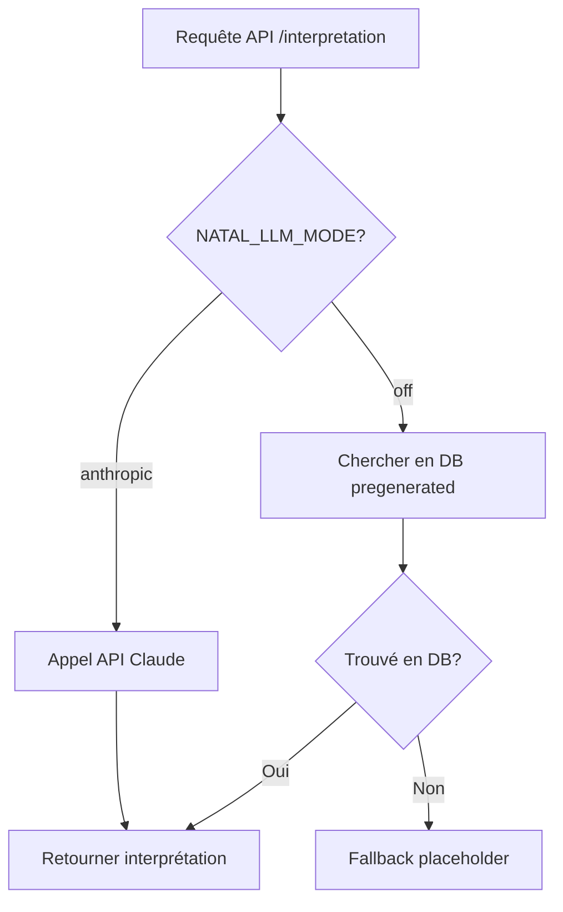

# Migration Interprétations Pré-générées : Fichiers .md → Base de Données

## ✅ Ce qui a été implémenté

### 1. Modèle DB
✅ `models/pregenerated_natal_interpretation.py` - Table pour stocker les interprétations
- Colonnes : `id`, `subject`, `sign`, `house`, `version`, `lang`, `content`, `length`, `created_at`, `updated_at`
- Index unique : `(subject, sign, house, version, lang)`
- Scope : 2160 lignes max (15 sujets × 12 signes × 12 maisons)

### 2. Migration Alembic
✅ `alembic/versions/29640bcd2fc6_add_pregenerated_natal_interpretations_.py`
- Crée la table `pregenerated_natal_interpretations`
- Crée les index pour performance
- **⚠️ À exécuter** : `alembic upgrade head` (quand DB accessible)

### 3. Service modifié
✅ `services/natal_interpretation_service.py`
- **Nouvelle fonction** : `load_pregenerated_interpretation_from_db()` - Charge depuis DB
- **Fonction existante conservée** : `load_pregenerated_interpretation()` - Charge depuis fichiers (backward compatibility)
- **Modifiée** : `generate_with_sonnet_fallback_haiku()` - Accepte paramètre `db` et charge depuis DB si fourni, sinon fallback sur fichiers

### 4. Route modifiée
✅ `routes/natal_interpretation.py`
- Passe maintenant la session `db` au service
- **Priorité** : DB → Fichiers .md → Placeholder

### 5. Script de migration
✅ `scripts/migrate_interpretations_to_db.py`
- Parse les 8 fichiers .md existants
- Insère en DB avec gestion des doublons (INSERT ou UPDATE)
- **⚠️ À exécuter** : `python scripts/migrate_interpretations_to_db.py` (quand DB accessible)

---

## 📋 Étapes suivantes (à faire quand DB accessible)

### Étape 1 : Exécuter la migration Alembic

```bash
cd apps/api

# Vérifier la version actuelle
alembic current

# Appliquer la migration
alembic upgrade head

# Vérifier que la table a été créée
# (via psql ou autre client DB)
```

**Résultat attendu** : Table `pregenerated_natal_interpretations` créée avec 3 index

---

### Étape 2 : Migrer les 8 interprétations existantes

```bash
cd apps/api

# Exécuter le script de migration
python scripts/migrate_interpretations_to_db.py
```

**Résultat attendu** :
```
================================================================================
MIGRATION INTERPRÉTATIONS PRÉ-GÉNÉRÉES : FICHIERS .MD → DB
================================================================================

📁 Fichiers trouvés: 8

  ✅ Parsé: sun en Verseau M11 (1236 chars)
  ✅ Parsé: moon en Taureau M2 (1269 chars)
  ✅ Parsé: mercury en Gémeaux M3 (1248 chars)
  ✅ Parsé: venus en Balance M7 (1144 chars)
  ✅ Parsé: mars en Bélier M1 (1056 chars)
  ✅ Parsé: jupiter en Sagittaire M9 (1143 chars)
  ✅ Parsé: saturn en Capricorne M10 (1137 chars)
  ✅ Parsé: north_node en Verseau M11 (1255 chars)

📊 Total parsé: 8 interprétations

  ➕ Insertion: sun en aquarius M11
  ➕ Insertion: moon en taurus M2
  ➕ Insertion: mercury en gemini M3
  ➕ Insertion: venus en libra M7
  ➕ Insertion: mars en aries M1
  ➕ Insertion: jupiter en sagittarius M9
  ➕ Insertion: saturn en capricorn M10
  ➕ Insertion: north_node en aquarius M11

================================================================================
RÉSUMÉ
================================================================================
✅ Insérés: 8
🔄 Mis à jour: 0
⏭️  Ignorés (déjà existants): 0
📊 Total traité: 8

✅ Migration terminée !
```

---

### Étape 3 : Tester le système

```bash
cd apps/api

# Lancer les tests (certains passeront, d'autres nécessiteront mise à jour)
pytest tests/test_natal_interpretation_pregenerated.py -v
```

**Tests à mettre à jour** :
- Les tests actuels testent le chargement depuis fichiers (OK pour backward compatibility)
- Ajouter de nouveaux tests pour le chargement depuis DB

**Test manuel via API** :
```bash
# Démarrer l'API
uvicorn main:app --reload --port 8000

# Tester une interprétation (nécessite authentification)
curl -X POST http://localhost:8000/api/natal/interpretation \
  -H "Authorization: Bearer YOUR_TOKEN" \
  -H "Content-Type: application/json" \
  -d '{
    "chart_id": "test",
    "subject": "sun",
    "lang": "fr",
    "chart_payload": {
      "subject_label": "Soleil",
      "sign": "Verseau",
      "house": 11,
      "degree": 15.5,
      "longitude": 315.5,
      "latitude": 48.0,
      "ascendant_sign": "Bélier",
      "aspects": []
    }
  }'
```

**Résultat attendu** : Interprétation du Soleil en Verseau M11 chargée depuis la DB

---

### Étape 4 : Générer les interprétations manquantes

**Option A : Génération progressive avec Claude Code**

Pour chaque nouvelle combinaison souhaitée :
1. Utiliser l'outil Task avec `model="opus"` pour générer le texte
2. Insérer directement en DB avec un script Python

Exemple :
```python
import asyncio
from database import get_async_session_context
from models.pregenerated_natal_interpretation import PregeneratedNatalInterpretation

async def insert_interpretation():
    async with get_async_session_context() as db:
        interpretation = PregeneratedNatalInterpretation(
            subject='pluto',
            sign='scorpio',
            house=8,
            version=2,
            lang='fr',
            content="""# ♇ Pluton en Scorpion
**En une phrase :** Tu transformes les profondeurs...

## Ton moteur
...

## Ton défi
...

## Maison 8 en Scorpion
...

## Micro-rituel du jour (2 min)
- ...
- ...
- ...
""",
            length=1200
        )
        db.add(interpretation)
        await db.commit()
        print("✅ Interprétation insérée")

asyncio.run(insert_interpretation())
```

**Option B : Génération massive (2160 interprétations)**

Créer un script interactif qui :
1. Génère une interprétation avec Claude Code (Opus 4.5)
2. Insère en DB
3. Continue jusqu'à 2160 interprétations

---

## 🔄 Workflow final



**Avantages DB vs Fichiers** :
- ✅ Scalable : 2160 lignes vs 2160 fichiers
- ✅ Performance : Index DB vs accès disque
- ✅ Maintenance : UPDATE SQL vs redéploiement
- ✅ Multi-langue : Colonne `lang`
- ✅ Analytics : Queries SQL possibles

---

## 🧹 Nettoyage optionnel (après migration)

Une fois que toutes les interprétations sont en DB, vous pouvez **optionnellement** :

1. **Supprimer les fichiers .md** (si vous ne voulez plus de fallback fichiers)
   ```bash
   rm -rf data/natal_interpretations/v2
   ```

2. **Supprimer la fonction** `load_pregenerated_interpretation()` (chargement depuis fichiers)
   - Garder uniquement `load_pregenerated_interpretation_from_db()`

3. **Simplifier les tests**
   - Supprimer les tests de chargement fichiers
   - Garder uniquement les tests DB

**⚠️ Recommandation** : Garder les fichiers .md et la fonction backward compatibility pendant quelques semaines pour sécurité.

---

## 📊 Statistiques actuelles

| Métrique | Valeur |
|----------|--------|
| Interprétations en fichiers | 8 |
| Interprétations en DB | 0 (après migration : 8) |
| Total possible (15×12×12) | 2160 |
| Couverture actuelle | 0.37% |
| Couverture après migration complète | 100% |

---

## ✅ Checklist

### Migration DB
- [ ] Exécuter `alembic upgrade head`
- [ ] Vérifier que la table existe en DB
- [ ] Exécuter `python scripts/migrate_interpretations_to_db.py`
- [ ] Vérifier que les 8 interprétations sont en DB
- [ ] Tester via API (1-2 requêtes)

### Tests
- [ ] Mettre à jour `tests/test_natal_interpretation_pregenerated.py`
- [ ] Ajouter tests pour chargement DB
- [ ] Vérifier que tous les tests passent

### Génération progressive
- [ ] Générer 10-20 interprétations supplémentaires importantes
- [ ] Valider la qualité
- [ ] Continuer selon besoins

### Production
- [ ] Déployer les changements (modèle + migration + service)
- [ ] Exécuter migration Alembic en production
- [ ] Exécuter script de migration fichiers → DB
- [ ] Monitorer les logs (recherche "pré-générée")

---

**Dernière mise à jour** : 2026-01-18
**Statut** : ✅ Code implémenté, ⏸️ En attente DB accessible
