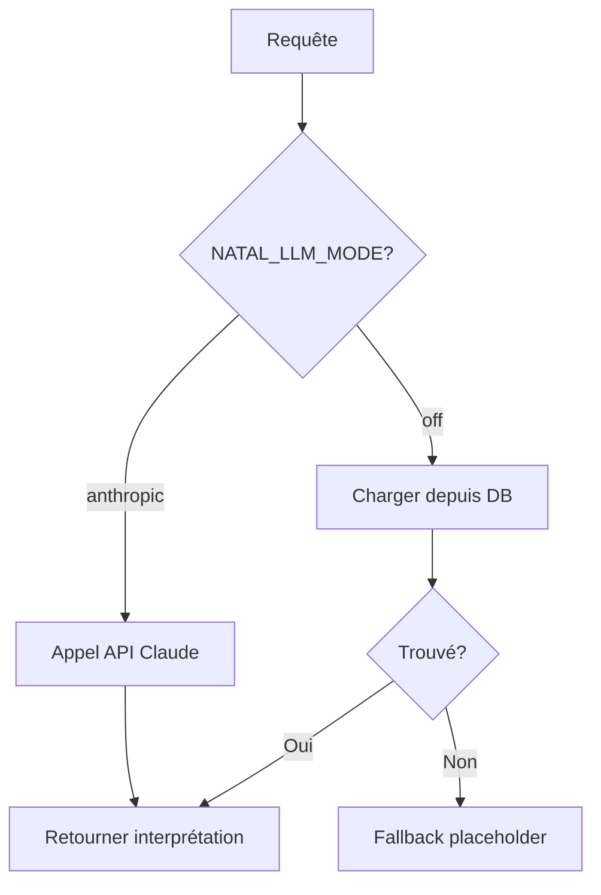

# Interprétations Pré-générées - Guide Complet

## 📚 Vue d'ensemble

Système d'interprétations astrologiques **pré-générées** stockées en **base de données** (au lieu de fichiers .md).

**Objectif** : Fournir des interprétations de qualité sans appel API en runtime.

---

## 🏗️ Architecture

### Avant (Fichiers .md)
```
data/natal_interpretations/v2/
├── sun/
│   ├── aquarius_11.md
│   └── ...
├── moon/
│   └── ...
└── ... (2160 fichiers potentiels)
```

### Après (Base de données) ✅
```sql
Table: pregenerated_natal_interpretations
- id (UUID)
- subject (VARCHAR) -- sun, moon, mercury, etc.
- sign (VARCHAR)    -- aries, taurus, gemini, etc.
- house (INTEGER)   -- 1-12
- version (INTEGER) -- 2, 4, etc.
- lang (VARCHAR)    -- fr, en, es, etc.
- content (TEXT)    -- Markdown complet
- length (INTEGER)
- created_at, updated_at
```

---

## 🔄 Workflow d'utilisation

### 1. Requête API `/api/natal/interpretation`



### 2. Code serveur

```python
# Route: routes/natal_interpretation.py
interpretation_text, model_used = await generate_with_sonnet_fallback_haiku(
    subject='sun',
    chart_payload={...},
    db=db  # Session DB pour charger pré-générées
)

# Service: services/natal_interpretation_service.py
if NATAL_LLM_MODE == 'off':
    # Charger depuis DB
    text = await load_pregenerated_interpretation_from_db(
        db=db,
        subject='sun',
        sign='Verseau',
        house=11,
        version=2,
        lang='fr'
    )
    # → SELECT ... WHERE subject='sun' AND sign='aquarius' AND house=11 ...
```

---

## ⚙️ Génération d'interprétations

### Méthode : Claude Code (Opus 4.5)

**Pas d'appel API automatique** - Vous générez manuellement avec Claude Code.

#### Étape 1 : Utiliser le script interactif

```bash
cd apps/api

python scripts/generate_and_insert_interpretation.py \
  --subject pluto \
  --sign scorpio \
  --house 8
```

#### Étape 2 : Le script affiche le prompt

```
📝 PROMPT POUR CLAUDE CODE (Opus 4.5):
--------------------------------------------------------------------------------
Tu es un·e astrologue moderne pour l'app Lunation...

DONNÉES DU THÈME:
- Pluton en Scorpion
- Maison 8 : intimité, transformation

TEMPLATE À SUIVRE (EXACT):
...
--------------------------------------------------------------------------------
```

#### Étape 3 : Générer avec Claude Code

Copiez le prompt et utilisez-le dans un outil Task avec `model="opus"` :

```python
# Dans Claude Code
Task(
    subagent_type="general-purpose",
    description="Générer interprétation Pluton Scorpion M8",
    model="opus",
    prompt="[COLLER LE PROMPT ICI]"
)
```

#### Étape 4 : Coller le résultat

Le script attend votre input. Collez l'interprétation générée, puis tapez `END`.

#### Étape 5 : Insertion automatique en DB

Le script insère l'interprétation en DB avec validation de longueur.

---

## 📊 Statistiques

```sql
-- Compter les interprétations par sujet
SELECT subject, COUNT(*)
FROM pregenerated_natal_interpretations
GROUP BY subject;

-- Compter par version
SELECT version, COUNT(*)
FROM pregenerated_natal_interpretations
GROUP BY version;

-- Trouver les combinaisons manquantes
-- (2160 possibles - N présentes = X manquantes)
SELECT 15 * 12 * 12 - COUNT(*) AS manquantes
FROM pregenerated_natal_interpretations
WHERE version = 2 AND lang = 'fr';
```

---

## 🔧 Maintenance

### Mettre à jour une interprétation

```sql
UPDATE pregenerated_natal_interpretations
SET content = '# ☀️ Soleil en Verseau ...',
    length = 1200,
    updated_at = NOW()
WHERE subject = 'sun'
  AND sign = 'aquarius'
  AND house = 11
  AND version = 2
  AND lang = 'fr';
```

### Supprimer une interprétation

```sql
DELETE FROM pregenerated_natal_interpretations
WHERE subject = 'lilith'  -- Par exemple, si on ne supporte plus Lilith
  AND version = 2;
```

### Ajouter une langue

```bash
# Générer version EN d'une interprétation existante
python scripts/generate_and_insert_interpretation.py \
  --subject sun \
  --sign aquarius \
  --house 11 \
  --lang en
```

---

## 🎯 Objectifs de couverture

| Phase | Interprétations | Couverture | Priorité |
|-------|----------------|------------|----------|
| **MVP** (actuel) | 8 | 0.37% | ✅ Placements harmonieux |
| **Phase 1** | 50-100 | 2-5% | 🎯 Domiciles + Exaltations |
| **Phase 2** | 500 | 23% | 📊 Combinaisons fréquentes |
| **Phase 3** | 2160 | 100% | 🚀 Couverture complète |

### Priorités de génération

1. **Domiciles** (planète dans son signe naturel)
   - Soleil en Lion, Lune en Cancer, Mercure en Gémeaux/Vierge, etc.

2. **Exaltations** (planète renforcée)
   - Soleil en Bélier, Lune en Taureau, etc.

3. **Maisons correspondantes**
   - Mars en Bélier M1, Vénus en Balance M7, etc.

4. **Combinaisons statistiquement fréquentes**
   - Analyser les charts utilisateurs pour prioriser

---

## 🧪 Tests

### Tests unitaires

```bash
cd apps/api
pytest tests/test_natal_interpretation_pregenerated.py -v
```

### Tests d'intégration

```python
# Test chargement DB
async def test_load_from_db():
    async with get_async_session_context() as db:
        text = await load_pregenerated_interpretation_from_db(
            db=db,
            subject='sun',
            sign='Verseau',
            house=11,
            version=2
        )
        assert text is not None
        assert '☀️ Soleil en Verseau' in text
```

### Test manuel API

```bash
# Vérifier qu'une interprétation est bien chargée depuis DB
curl -X POST http://localhost:8000/api/natal/interpretation \
  -H "Authorization: Bearer $TOKEN" \
  -d '{"chart_id":"test","subject":"sun",...}'

# Vérifier les logs
# → "✅ Interprétation pré-générée chargée depuis DB: sun en Verseau M11"
```

---

## 📁 Fichiers importants

```
apps/api/
├── models/
│   └── pregenerated_natal_interpretation.py  # Modèle SQLAlchemy
├── alembic/versions/
│   └── 29640bcd2fc6_add_pregenerated_natal_interpretations_.py  # Migration
├── services/
│   └── natal_interpretation_service.py  # load_pregenerated_interpretation_from_db()
├── routes/
│   └── natal_interpretation.py  # Passe session DB au service
├── scripts/
│   ├── migrate_interpretations_to_db.py  # Migration fichiers → DB
│   └── generate_and_insert_interpretation.py  # Génération interactive
└── docs/
    ├── MIGRATION_PREGENERATED_TO_DB.md  # Guide migration
    └── PREGENERATED_INTERPRETATIONS_README.md  # Ce fichier
```

---

## ❓ FAQ

### Q: Pourquoi DB au lieu de fichiers .md ?

**R:** Pour 2160 interprétations :
- ✅ DB = 2160 lignes (scalable)
- ❌ Fichiers = 2160 fichiers (lourd pour Git)
- ✅ DB = Performance (index)
- ✅ DB = Maintenance sans redéploiement
- ✅ DB = Support multi-langues facile

### Q: Les fichiers .md sont-ils supprimés ?

**R:** Non, conservés pour backward compatibility. Le système essaie DB d'abord, puis fichiers .md si DB échoue.

### Q: Comment ajouter une nouvelle langue ?

**R:** Générer l'interprétation et l'insérer avec `lang='en'` (ou `es`, etc.). La contrainte unique `(subject, sign, house, version, lang)` permet plusieurs langues pour la même combinaison.

### Q: Peut-on modifier une interprétation sans redéploiement ?

**R:** Oui ! Simple `UPDATE SQL` en production. C'est un des avantages majeurs de la DB.

### Q: Que se passe-t-il si une interprétation n'est pas en DB ?

**R:** Fallback intelligent :
1. Essai chargement DB
2. Essai chargement fichier .md (si existe)
3. Placeholder générique

---

## ✅ Checklist déploiement

### Développement
- [x] Modèle SQLAlchemy créé
- [x] Migration Alembic créée
- [x] Service modifié (chargement DB)
- [x] Route modifiée (passe session DB)
- [x] Scripts de migration/insertion créés
- [x] Documentation complète

### Production
- [ ] Exécuter `alembic upgrade head`
- [ ] Exécuter `python scripts/migrate_interpretations_to_db.py`
- [ ] Vérifier 8 interprétations en DB
- [ ] Tester 2-3 requêtes API
- [ ] Monitorer logs ("pré-générée chargée depuis DB")

### Extension
- [ ] Générer 50-100 interprétations prioritaires
- [ ] Valider qualité
- [ ] Analyser statistiques usage
- [ ] Continuer génération selon besoins

---

**Dernière mise à jour** : 2026-01-18
**Version** : 2.0.0 (Migration DB)
**Statut** : ✅ Code prêt, ⏸️ En attente DB accessible
